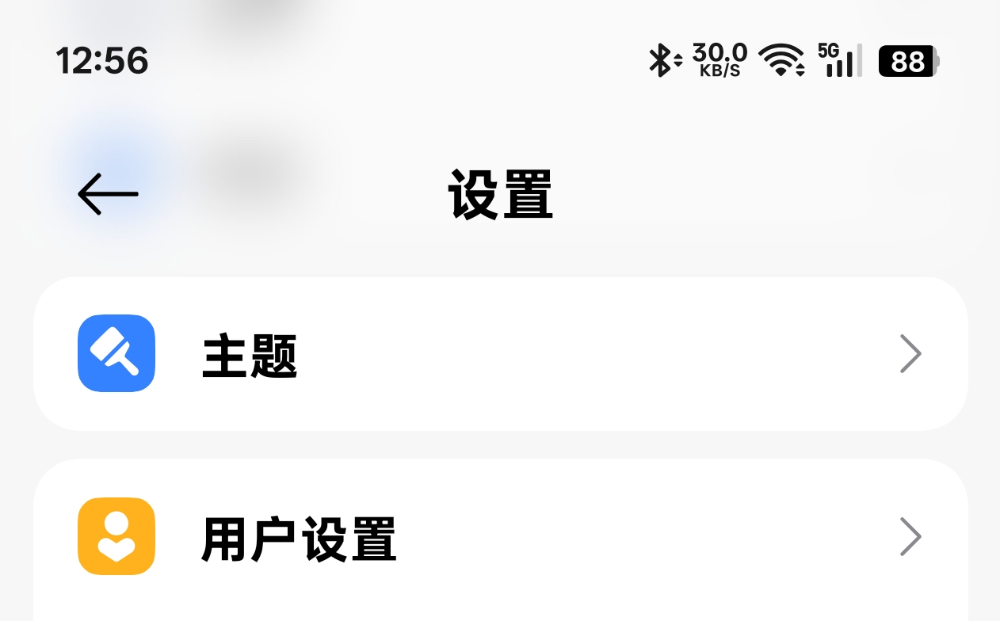

<div align="center">

# Gustate AppBar

  

一个高度可定制的Android应用顶栏组件，支持模糊效果、系统栏适配和多种布局配置。

</div>

## ✨ 特性

- 🎨 支持背景模糊效果（基于 [BlurView](https://github.com/Dimezis/BlurView)）
- 📏 自动适配系统状态栏和导航栏
- ⚙️ 丰富的XML属性配置
- 🎯 多种标题布局重力选项
- 🖌️ 完整的代码动态配置API
- 🌙 深色模式友好

## 📦 安装

### Step 1. 添加JitPack仓库

在项目根目录的 `build.gradle.kts` 中添加：

```kts
dependencyResolutionManagement {
    repositoriesMode.set(RepositoriesMode.FAIL_ON_PROJECT_REPOS)
    repositories {
        // 添加 JitPack
        maven("https://jitpack.io")
    }
}
```

### Step 2. 添加依赖

在 `:app` 的 `build.gradle.kts` 中添加：

```kts
dependencies {
    implementation("com.github.JiaGuZhuangZhi:Gustate-AppBar:v1.0.0")
}
```

## 🚀 快速开始

### XML布局中使用

```xml
<com.gustate.appbar.classic.ClassicHeaderBar
    android:id="@+id/headerBar"
    android:layout_width="match_parent"
    android:layout_height="wrap_content"
    app:chb_bkg_blur_enable="true"
    app:chb_bkg_blur_overlay="@color/white"
    app:chb_bkg_blur_overlay_alpha="0.6"
    app:chb_bkg_blur_radius="25"
    app:chb_header_bar_height="60dp"
    app:chb_status_bar_height="24dp"
    app:chb_system_bars_yield_enable="true"
    app:chb_title="应用标题"
    app:chb_title_gravity="chb_center"
    app:chb_left_btn_enable="true"
    app:chb_left_btn_src="@drawable/ic_back"
    app:chb_right_btn_enable="true"
    app:chb_right_btn_src="@drawable/ic_more"/>
```

### 代码中配置

```kotlin
// 系统栏适配
ViewCompat.setOnApplyWindowInsetsListener(binding.root) { _, insets ->
    val systemBars = insets.getInsets(WindowInsetsCompat.Type.systemBars())
    binding.classicHeaderBar.setSystemBarsPadding(
        nIsYieldStatusBar = true,
        nStatusBarHeight = systemBars.top,
        nLeftSystemBarWidth = systemBars.left,
        nRightSystemBarWidth = systemBars.right
    )
    insets
}

// 动态修改标题
binding.headerBar.setTitle("新的标题")

// 修改透明度
binding.headerBar.changeHeader { currentAlpha ->
    if (isScrolled) 0.5f else 1.0f
}
```

## 📋 属性说明

### 系统栏属性

|属性|类型|说明|
|-|-|-|
|chb_status_bar_height|dimension|状态栏高度|
|chb_left_system_bar_width|dimension|左侧系统栏宽度|
|chb_right_system_bar_width|dimension|右侧系统栏宽度|
|chb_system_bars_yield_enable|boolean|是否避让系统栏|

### 基本属性

|属性|类型|说明|
|-|-|-|
|chb_header_bar_height|dimension|应用栏高度|

### 背景属性

|属性|类型|说明|
|-|-|-|
|chb_bkg|reference/color|背景资源|
|chb_bkg_blur_enable|boolean|是否启用模糊效果|
|chb_bkg_blur_radius|float|模糊半径|
|chb_bkg_blur_overlay|color|模糊覆盖层颜色|
|chb_bkg_blur_overlay_alpha|float|模糊覆盖层透明度|
|chb_bkg_blur_target|reference|模糊目标视图|

### 按钮属性

|属性|类型|说明|
|-|-|-|
|chb_left_btn_enable|boolean|是否显示左侧按钮|
|chb_left_btn_src|reference|左侧按钮图标|
|chb_left_btn_tint|color|左侧按钮色调|
|chb_left_btn_margin_start|dimension|左侧按钮起始边距|
|chb_right_btn_enable|boolean|是否显示右侧按钮|
|chb_right_btn_src|reference|右侧按钮图标|
|chb_right_btn_tint|color|右侧按钮色调|
|chb_right_btn_margin_end|dimension|右侧按钮结束边距|

### 标题属性

|属性|类型|说明|
|-|-|-|
|chb_title|string|标题文本|
|chb_title_gravity|enum|标题重力位置|
|chb_title_margin_start|dimension|标题起始边距|
|chb_title_margin_end|dimension|标题结束边距|

## 🎨 标题重力选项

|选项|值|说明|
|-|-|-|
|START_WITH_LEFT_BTN|0|紧靠左侧按钮|
|CENTER|1|居中显示（默认）|
|IN_FRONT_OF_RIGHT_BTN|2|紧靠右侧按钮前|

## 📖 API 参考

### 主要方法

|方法|说明|
|-|-|
|setSystemBarsPadding()|设置系统栏边距|
|setHeaderBarHeight()|设置应用栏高度|
|setHeaderBarBackground()|设置背景|
|enableBlurEffect()|启用/禁用模糊效果|
|setLeftButton()|设置左侧按钮|
|setRightButton()|设置右侧按钮|
|setTitle()|设置标题|
|setTitleGravity()|设置标题重力|
|changeHeader()|修改头部透明度|

## 🤝 贡献

欢迎提交 Issue 和 Pull Request！

## 📄 许可证

``` text
Copyright 2024 JiaGuZhuangZhi

Licensed under the Apache License, Version 2.0 (the "License");
you may not use this file except in compliance with the License.
You may obtain a copy of the License at

    http://www.apache.org/licenses/LICENSE-2.0

Unless required by applicable law or agreed to in writing, software
distributed under the License is distributed on an "AS IS" BASIS,
WITHOUT WARRANTIES OR CONDITIONS OF ANY KIND, either express or implied.
See the License for the specific language governing permissions and
limitations under the License.
```

## 🙏 致谢

感谢以下开源项目：

- [AndroidX](https://github.com/androidx/androidx) - 提供基础组件支持
- [BlurView](https://github.com/Dimezis/BlurView) - 提供模糊效果支持

注：本项目仅引用上述项目的技术实现，不代表认可其政治立场或价值观，排名不分先后。

---

<div align="center">
如果这个项目对你有帮助，请给它一个⭐！
</div>
